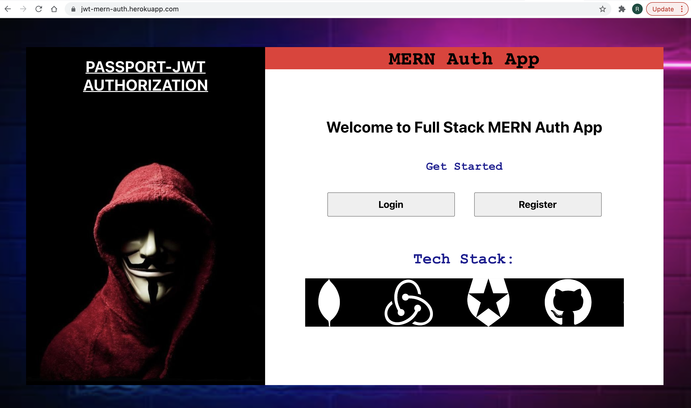
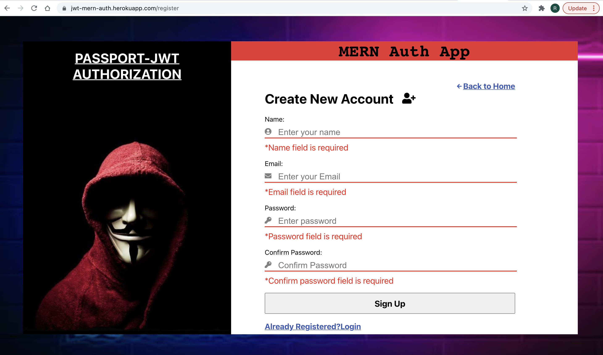
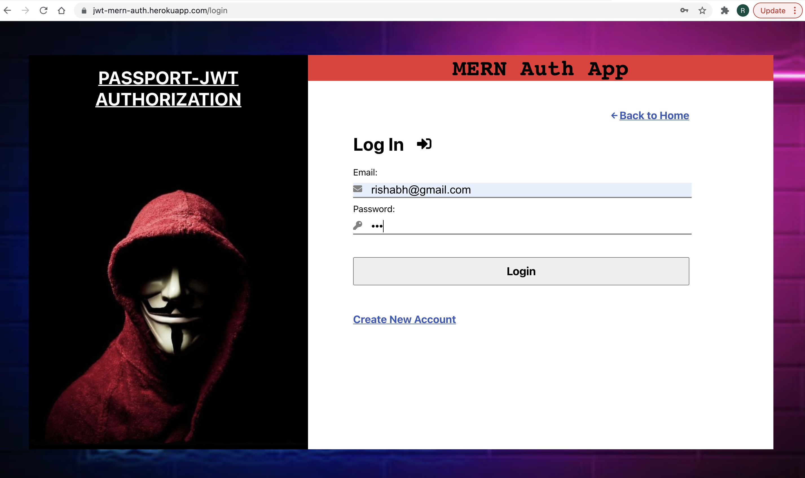
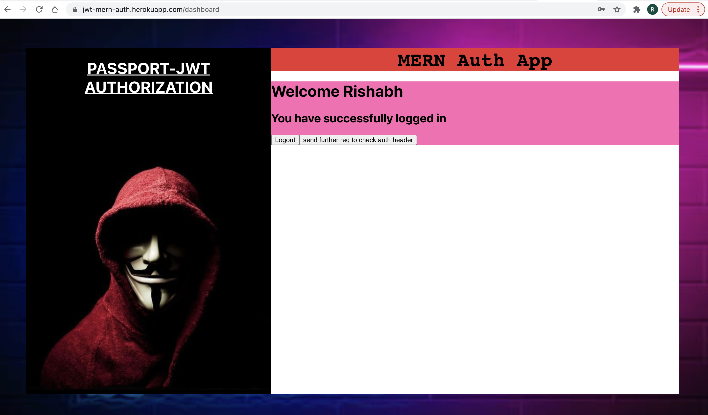
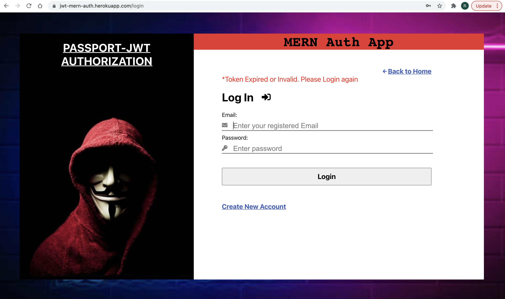

# JWT-PASSPORT MERN AUTH APP

> A Full-Stack app with user Login/Signup functionality deployed on [Heroku](https://jwt-mern-auth.herokuapp.com/ "Heroku").It uses JSON Web Token (JWT) for
User Authorization and information exchange and Passport.js as authentication MiddleWare. Further, it implements Redux for Global State Management and 
Asymmetric Cryptography for generating Public/Private key pair.

## Features
- [x] New users can register using their Email and Password.
- [x] Successfully registered users can Login to access Dashboard.
- [x] Users stay logged in even after closing the app or refreshing the page.
- [x] Token expiry to Logout user after stipulated time.

## Functioning
### 1. User visits the application and receives a Welcome Page
> 

### 2. New users click on the Register button to create account.
### 3. Validation checks are performed on the form data entered by the user.
> 

### 4. Existing users click on the Login button.
### 5. Enter the details used at the time of Registration.
> 

### 6. User is redirected to the Dashboard if the details match.
> 

### 7. Token expires after stipulated time and the user is redirected back to Login page.
> 

## How to run on Local:
1. Clone the repository or download the zip file.
2. Setup your virtual environment.
3. Install the dependancies using `npm install `
4. Run command `npm run dev` to start the application.

The application is also deployed on [Heroku](https://jwt-mern-auth.herokuapp.com/ "Heroku").
